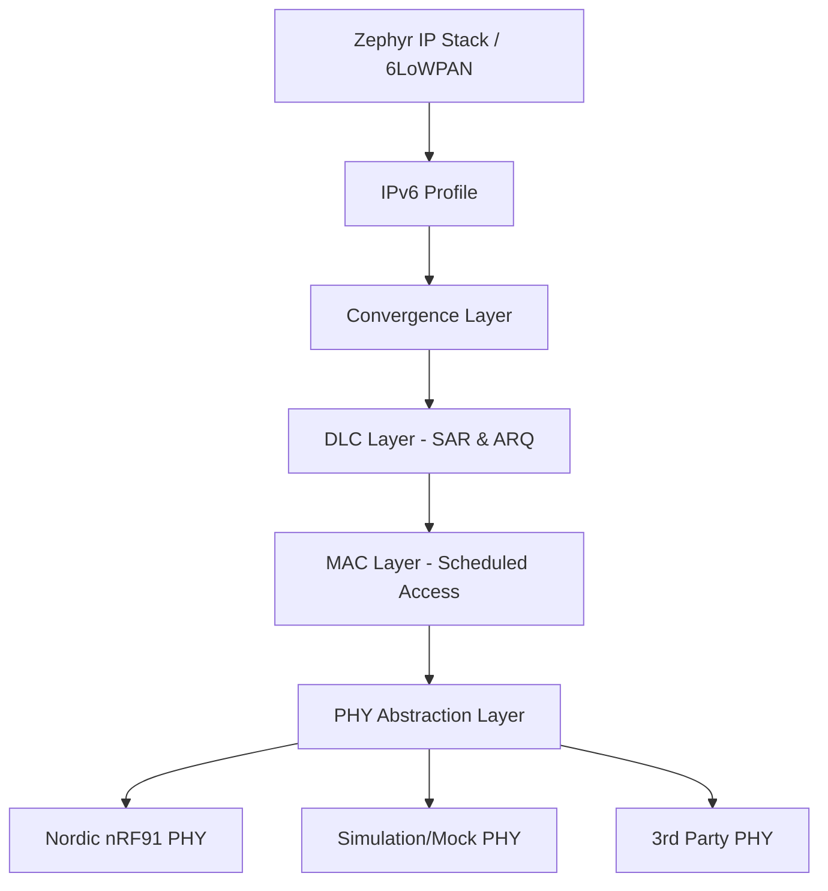
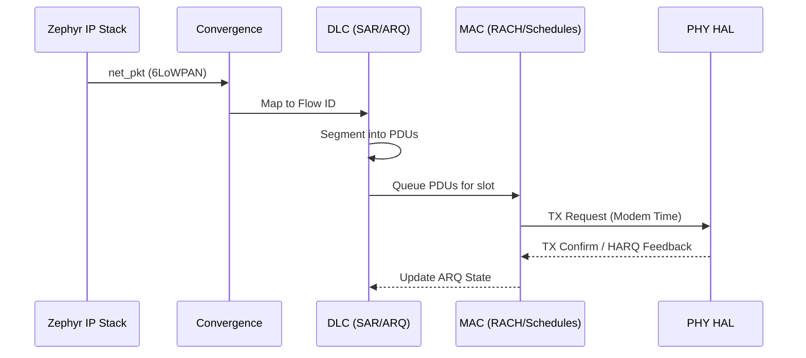
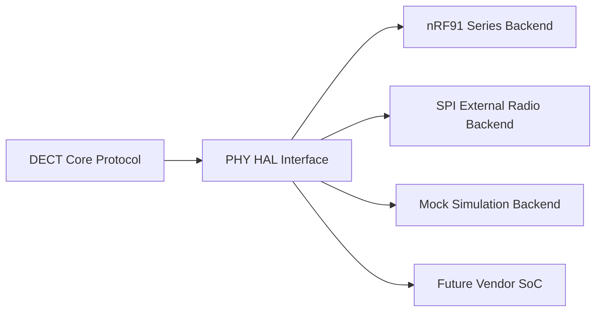

# DECT NR+ Driver Architecture
## Reference Stack Strategy & Roadmap
### Production-Grade Zephyr Implementation (v3)

---

# 1. Current Architecture Assessment

### **Project Foundation**
*   **Compliance**: Full alignment with **ETSI TS 103 636** (Parts 3-5) and **ETSI TS 103 874** (Access & IPv6 Profiles).
*   **Module Structure**: Canonical separation into `core/` (PHY, MAC, DLC, CVG), `management/` (CDD), and `profiles/` (IPv6).
*   **Zephyr Integration**: Native L2 Network Device driver with PSA Crypto and NVS integration.

### **System Layers & Canonical Structure**

---

# 1. Assessment: Core Strengths & Rules

### **The "Golden Rules" of the Stack**
*   **No Blocking Delays**: Zero `delay_us()`. Timing is event-driven via interrupts.
*   **Zero Heap Usage**: Static ring buffers for all queues to ensure determinism.
*   **Big-Endian Consistency**: Strict MSB-first wire order per ETSI specifications.
*   **Security Priority**: Hardened PSK Auth and HPC sync backed by NVS.

| **Strengths** | **Current Gaps** |
| :--- | :--- |
| Layered Canonical Structure | Short RD ID collision detection |
| PSA Crypto for AES/CMAC | Full SMF Migration for MAC-C |
| 6LoWPAN IID Generation | Advanced Mesh SSR Routing |

---

# 2. Technical Requirements & Expectations

### **Data Path & Buffer Flow**

---

# 3. Reference Stack Roadmap (Phased)

### **Phase 1-2: Link & Robustness**
*   **MVP Completion**: Stability for FT↔PT basic link via `native_sim` and `nRF9161`.
*   **CDD & IPv6**: Implementation of Config Data Distribution (Annex C) for IPv6 context discovery.

### **Phase 3-4: Mesh & Multi-Peer**
*   **QoS Multi-Queue**: 4-lane priority system (Control, High, Med, Low).
*   **Mesh Routing**: Flood loop prevention and Shortest-Sync-Path Routing (SSR).
*   **SFN Relaying**: Enabling multi-hop synchronization for relay nodes.

---

# 4. Future: Multi-Vendor & Hardware Portability

### **Vendor-Agnostic Core**
The stack is being refactored to isolate all silicon-specific logic into a **Hardware Abstraction Layer (HAL)**.

*   **PHY HAL (`dect_phy.h`)**: Standardized, asynchronous interface for all radio operations.
*   **Third-Party Silicon Support**: Standardized API for 3rd party SoCs to implement the `dect_phy` shim.
*   **External Radio Support**: Capability for SPI/UART-connected exterior DECT NR+ radio modules.
*   **Integrated Simulation**: Mock PHY enables 100% protocol testing in `native_sim` without silicon.

### **Abstraction Architecture**

---

# Conclusion

The DECT NR+ stack is evolving from a Nordic-specific driver into a **universal, portable communication library**. 

By enforcing **asynchronous, non-blocking**, and **static memory** patterns, we provide a foundation that is easily portable across any Zephyr-supported SoC with DECT NR+ radio capabilities.

---
